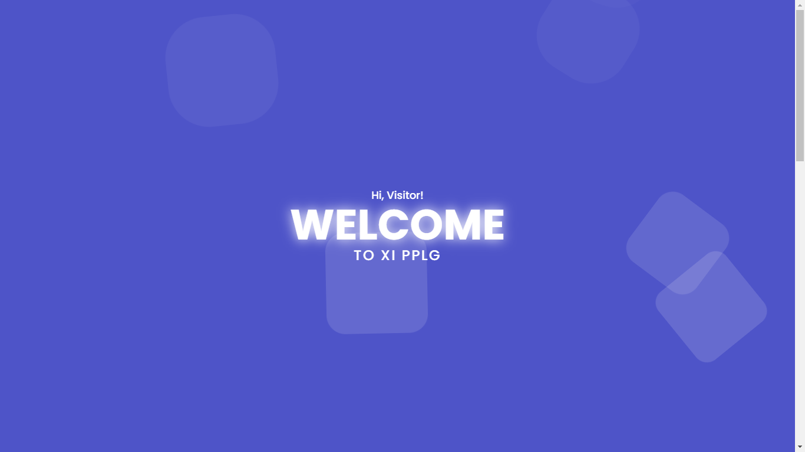

## Class Profile Website Template - Laravel, TailwindCSS, Flowbite Framework 🎓  

Free template for class profile made using Laravel, TailwindCSS, and Flowbite!  
It is a fully responsive template which you can use for your class or maybe for your own portfolio website.

🌐 Demo Site: https://xi.pplgxcode.biz.id/

## Website Features 💻
- Fully responsive design
- Built with Laravel 11 and TailwindCSS for modern and clean UI
- Flowbite components for enhanced UI elements
- SEO friendly
- Includes basic class profile structure: Home, Gallery, Schedule

### Installation ⚙️
- Clone the repository
```
git clone https://github.com/alanzagi/pplg-angkatan-5.git
```
- Navigate to the Project Directory
```
cd pplg-angkatan-5
```
- Install Dependencies
```
composer install
npm install
```
- Configure Environment Variables
```
cp .env.example .env
```
- Build Frontend Assets with TailwindCSS
```
npm run dev
```
- Start the Development Server
```
php artisan serve
```
- Done

## Support Me ❤️
Here to support me on [Trakteer](https://trakteer.id/alan_zagi)  
You can start supporting by buying me an ice cream 🍦  
start from Rp10.000 / 0.64 USD. Thank you very much! 🙏

# Business inquiries 💼
If you need my services, like deployment this website to online,  
you can start talk to me for business cooperation.  
Click the [Link](https://linktr.ee/alanzagi) to start message me.

## Resources Used 🛠️
1. [Laravel v11](https://laravel.com/docs/11.x)
2. [Tailwind CSS v3.4.13](https://tailwindcss.com/docs/installation)
3. [Flowbite v2.5.2](https://flowbite.com/docs/getting-started/introduction/)
4. [DataAOS for Scroll Animation](https://github.com/michalsnik/aos)

## License ©️

The Laravel framework is open-sourced software licensed under the [MIT license](https://opensource.org/licenses/MIT).
